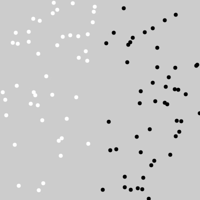

# Fundamentos de Estatística
### Exercício 1
#### Crie uma aplicação que distribua no canvas pontos brancos e pretos.

### Exercício 2
#### Obtenha a média dos tons de cinza da imagem abaixo.

### Exercício 3
#### Faça uma aplicação em que um quadrado siga o ponteiro do mouse na direção horizontal, a movimentação do quadrado deverá ser suave, de modo que ele acelere e desacelere quando estiver perto de mudar de sentido.

### Exercício 4 
#### Recrie a aplicação anterior, fazendo-a contemplar também a movimentação vertical do cursor do mouse.

