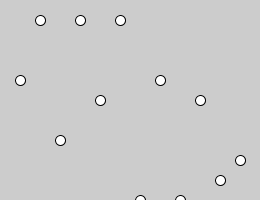
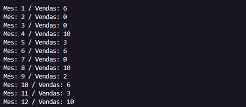
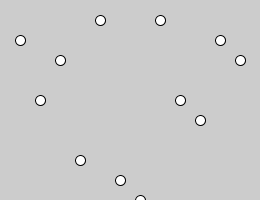
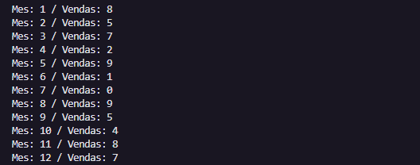
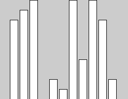
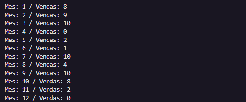

# Design da informação
### Exercício 1
#### Tente aumentar os espaços horizontal e vertical entre os pontos do gráfico e experimente multiplicar os valores das componentes x e y por outros valores e observe o resultado.

### Exercício 2
#### Tente corrigir o gráfico, invertendo-o verticalmente, realize uma translação.

### Exercício 3
#### Transforme o gráfico de pontos anterior, em um gráfico de barras.

