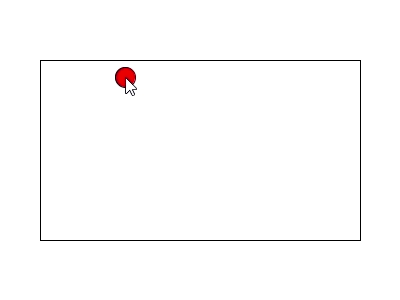

# Distância e Proporção
### Exercício 1
#### Empregando a função dist() do Processing, exemplifique como a posição do mouse, numa janela com proporção 4:3, pode mover um círculo no interior de um retângulo com proporção 16:9 centralizado na tela.

### Exercício 2
#### Faça o mesmo do item anterior, mas agora empregando a função map().

