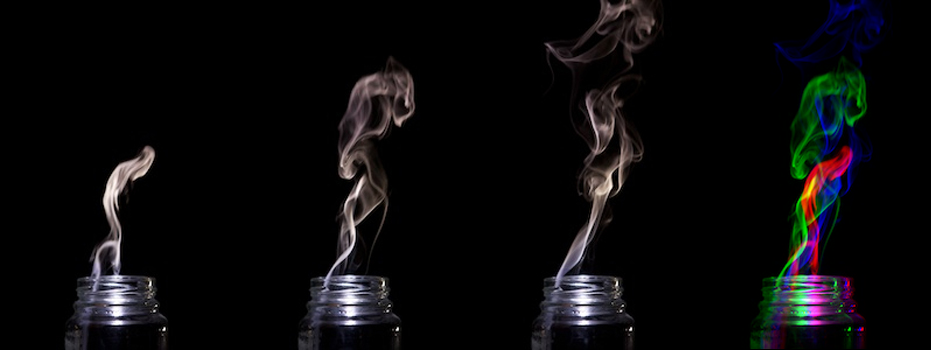
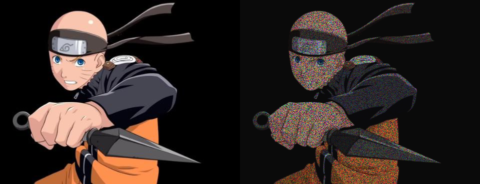

# Filtros
### Exercício 1
#### Crie uma aplicação que exiba a imagem original em <b>negativo</b>, empregando o método <i>filter</i> da classe <i>PImage</i>.

### Exercício 2
#### Recrie a aplicação para que a mesma exiba separadamente e simultaneamente os canais R, G e B da imagem original.

### Exercício 3
#### Implemente o passo-a-passo anterior e apresente em sua aplicação: As 3 imagens originais e a imagem resultante da construção do efeito.

### Exercício 4 
#### Voltando à imagem do início da aula (original.png), recrie a aplicação da Atividade 1 para que a mesma exiba a imagem em tons de cinza, desta vez com base na média aritmética dos canais R, G e B.

### Exercício 5
#### Recrie a aplicação para que a mesma exiba a imagem em tons de cinza obtidos através da média ponderada dos canais (0.3*R + 0.59*G + 0.11*B).

### Exercicio 6
#### Recrie a aplicação para que a mesma exiba o negativo da imagem original.

### Exercício 7
#### Crie uma aplicação que aplique uma certa quantidade de ruído a uma imagem à sua escolha, com a quantidade de pixels alterados definida por uma variável.

