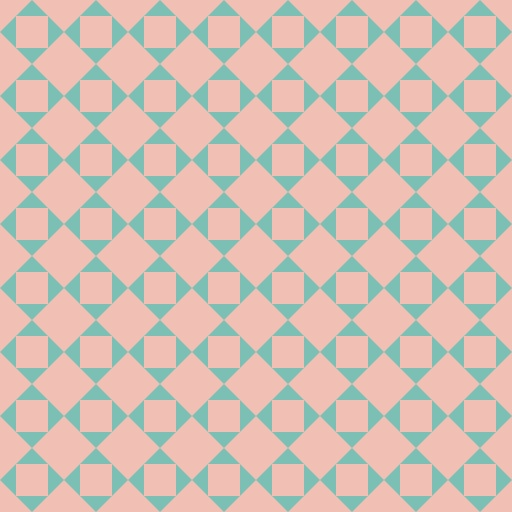

# Introdução à Algebra Booleana
## Exercício 1
### Com uma harmonia cromática complementar, crie um algoritmo que desenhe dois quadrados utilizando a harmonia. Os quadrados devem ser equidistantes entre si e as bordas da tela. Quando o mouse entrar no 1º quadrado, o fundo da tela deve ser alterado para a cor dele, quando entrar no 2º, funda da tela com a cor do 2º, e cor preta quando o mouse não está em nenhum dos 2.

## Exercício 2
### Desenhe uma peça com harmonia cromática complementar e depois repita padrão geométrico.

## Exercício 3
### Modifique o padrão geométrico anterior e habilite a função de clique do mouse para mudar a harmonia cromática.

