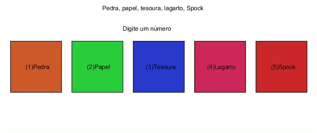

# If Aninhados
## Exercício 1
### Implemente no Processing ou escreva em um papel um programa que represente o jogo "pedra,papel, tesoura, lagarto, Spock", apresentado por Sheldon Cooper, na série "The Big Bang Theory".

