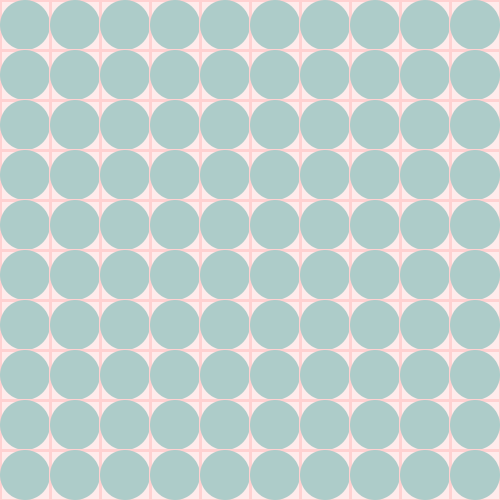
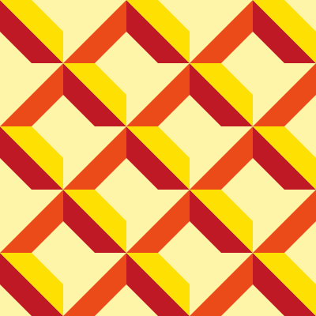

# Estruturas de Seleção
## Exercício 1
### Vamos fazer uma aplicação que ao apertar uma tecla, desenha uma elipse em uma grade em uma posição aleatória. Apertando a tecla várias vezes, eu terei a grade toda preenchida. Agora eu quero que se a elipse desenhada estiver em uma diagonal, ela aparecerá com uma cor diferente:

## Exercício 2
### Exercite sua criatividade e altere o código anterior usando cores (harmonias) e novos padrões de desenho. Por exemplo, verificar se a elipse está em um dos lados (direita/esquerda, cima/baixo), nos quadrantes, ou se a posição é par/ímpar para alternar as cores entre as elipse, etc.

## Exercício 3

## Exercício 4

