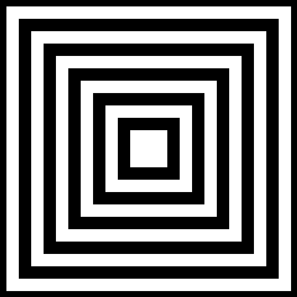
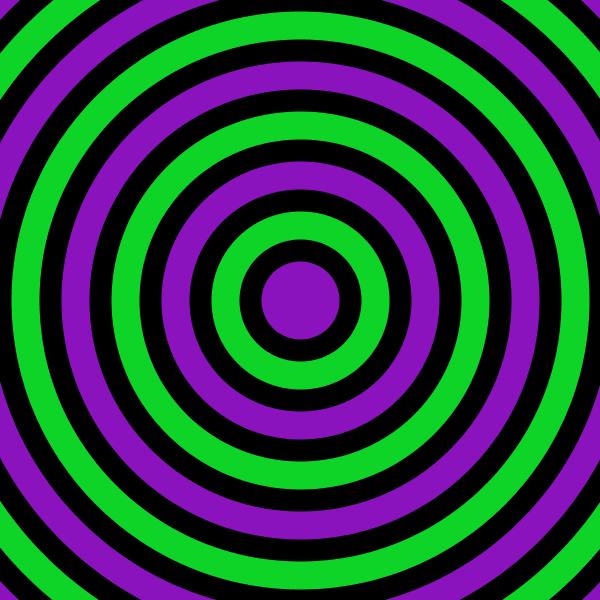
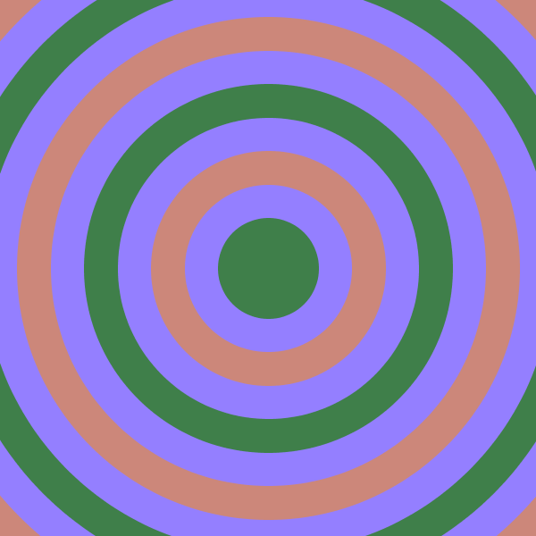

# Estruturas de Repetição
## For
### Exercício 1

### Exercício 2

### Exercício 3

### Exercício 4

## For Aninhado
### Exercício 1

### Exercício 2

### Exercício 3

### Exercício 4

## While e DoWhile
### Exercício 1

### Exercício 2

### Exercício 3

