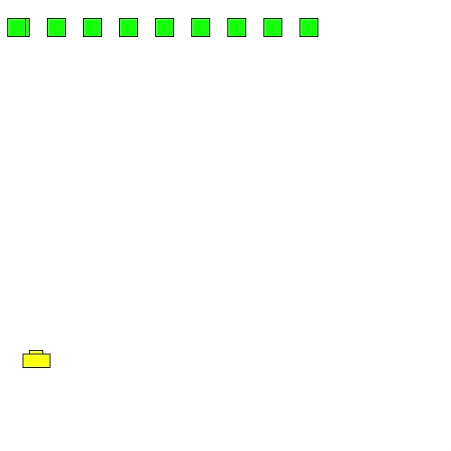

# Space Invaders
### AV1 - Construir um jogo atari contendo elemento principal móveis controlado pelo jogador e um cenários que restrinja os movimentos de alguma maneira.
### AV2 - O jogo da AP1 deve ser expandido com pelo menos 2 elementos móveis que se movem automaticamente. Além disso o jogador de interagir de alguma maneira com os elementos novos (morrer quando tocar,destruir quando tocar, destruir quando apertar um tecla com o inimigo em um posição especifica, etc).

